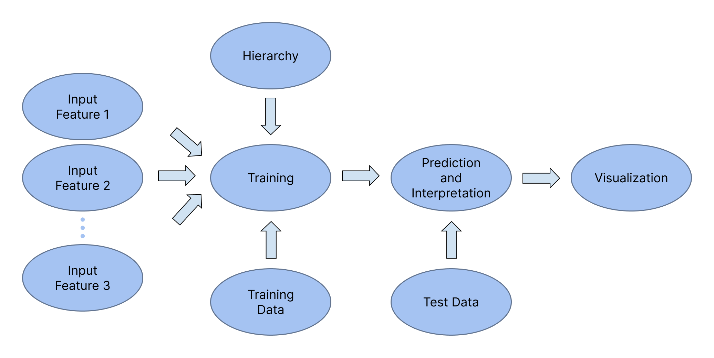

Cell Maps VNN (Cell Maps Visible Neural Network) Tool
================================================================

.. image:: https://img.shields.io/pypi/v/cellmaps_vnn.svg
        :target: https://pypi.python.org/pypi/cellmaps_vnn

.. image:: https://app.travis-ci.com/idekerlab/cellmaps_vnn.svg
        :target: https://app.travis-ci.com/idekerlab/cellmaps_vnn

.. image:: https://readthedocs.org/projects/cellmaps-vnn/badge/?version=latest
        :target: https://cellmaps-vnn.readthedocs.io/en/latest/?badge=latest
        :alt: Documentation Status

**Cell Maps VNN** builds interpretable neural networks from biological hierarchies to predict cellular responses to
drugs—while keeping every step transparent, reproducible and FAIR.

It enables the creation, training, and application of  neural network models whose architecture mirrors a biological
hierarchy. This makes the model’s internal structure both visible and interpretable, helping researchers connect
predictions to biological context.

A hierarchy in `HCX <https://cytoscape.org/cx/cx2/hcx-specification/>`__ format—such as one generated by the
`cellmaps_generate_hierarchy <https://cellmaps-generate-hierarchy.readthedocs.io/>`__ tool—defines the structure of
the visible neural network.

The tool produces separate output directories for training, prediction, and annotation.
Results in these directories are stored and registered as
`Research Object Crates (RO-Crate) <https://www.researchobject.org/ro-crate>`__ using the
`FAIRSCAPE-cli <https://pypi.org/project/fairscape-cli>`__ framework.

**Overview of Cell Maps VNN Flow**

* Free software: MIT license
* Source code: https://github.com/idekerlab/cellmaps_vnn

.. toctree::
   :maxdepth: 2
   :caption: Contents:

   installation
   usage
   inputs
   outputs
   modules
   developer
   authors
   history

Indices and tables
==================
* :ref:`genindex`
* :ref:`modindex`
* :ref:`search`
